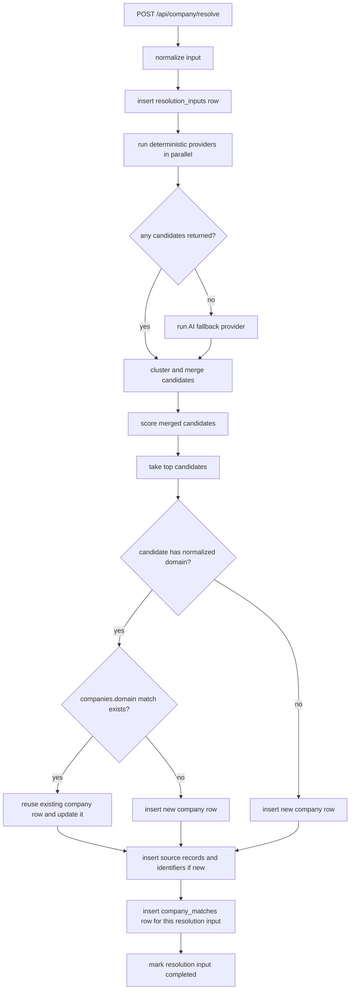
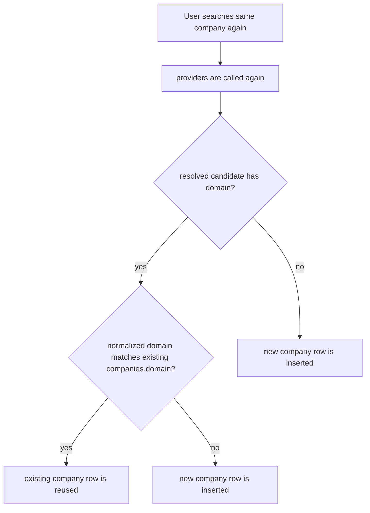
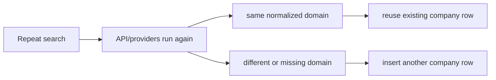

# Repeat Search Flow

These diagrams show the current behavior when a user searches for a company, including what can happen on a repeated search.

## Request Flow

## Repeat Search Decision Path

## Outcome Summary

## Notes

- Reuse is post-provider, not pre-provider.
- Reuse is domain-based, not name-based.
- Identifiers and source records help persistence and auditability, but they are not currently used as alternate request-time reuse keys.
